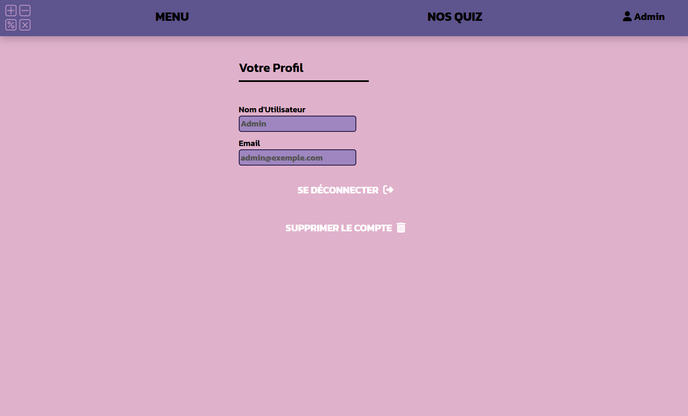
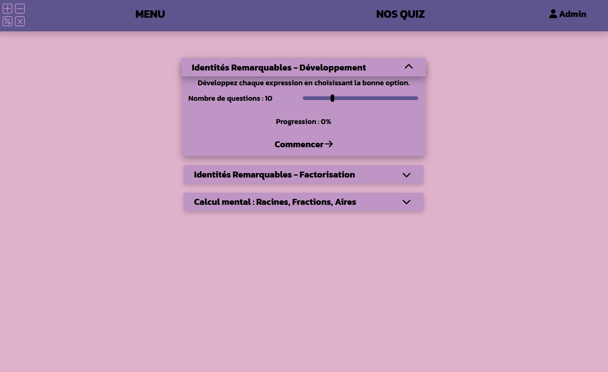

# DefiMaths

DefiMaths is an open-source project that aims to provide a flexible template for a complete quiz website. This template mainly focuses on math typed quizzes. It supports complex math symbols using `MathJax`.

## Features

- **Simple time based quizzes** : Easily create quizzes and provides three exemple in the `Assets/Quiz` folder.
- **Multiple answer types** : Use the two different built-in answer types (`multipleChoice` and `freeAnswer`) or create your own. The `multipleChoice` type allows you to set up to four (recommended maximum) different answers. With the `freeAnswer` type, it's up to the user to get the correct answer.
- **Basic account management** : Users can easily register and login with the account system. The passwords stored in the linked database are hashed for better security.
- **Progress tracking** : Users progress is stored in the database and displayed when they select a quiz.
- **Responsive design (work in progress)** : The current design of this template is not responsive, but I'm actively working on it.

## Installation

1. Download the source code of this repository or clone it to your local machine using this bash command :
```bash
   git clone https://github.com/SAMSAM-55/DefiMaths.git
```

2. Ensure your web server or hosting service supports PHP.
3. Upload all the files on your domain (make sure the folders have the exact same names).
4. Follow the instruction in the `config.php` file to setup the database. Some parts of the instructions might be specific to MySQL.

## Customisation

**Defimaths** includes a few customisable features in its css. You can adjust the colors of the website in `style.css` :

```css
:root {
    /* Main theme color and variables (some of the colors might also be used in other components than the specified ones) */
    --border-color: #ffffff00; /* Border color for buttons */
    --header-text-before-width: 75%; /* Width of the header texts underline */
    --theme-background-color : #E0B1CB; /* Background color of the page */
    --theme-header-color : #5E548E; /* Header color */
    --theme-button-color-normal : #BE95C4; /* Normal button color */
    --theme-button-color-hovered : #9F86C0; /* Hovered button color */
    --theme-button-color-selected : #231942; /* Selected button color */
    --score-text-size : 48px; /* Font size for the score text */
}
```

You can also choose the main font of the site by modifying the following line in `style.css` :

```css
*:not(mjx-container):not(mjx-container *) {
    font-family: 'Kanit', sans-serif; /* Main site font */
}
```

## Technologies used

 - Frontend : HTML, CSS and JavaScript
 - Backend : PHP
 - Database : MySQL

### Dependencies
 - MathJax
 - FontAwesome

## Preview

Below are some screenshots showcasing the profile page and quiz selection page of the project:





You can see an exempe of this project being used at [defimaths.net](https://defimaths.net "DéfiMaths").

## License

This project is licensed under the MIT License. See the [LICENSE](./LICENSE "MIT License") file for details.